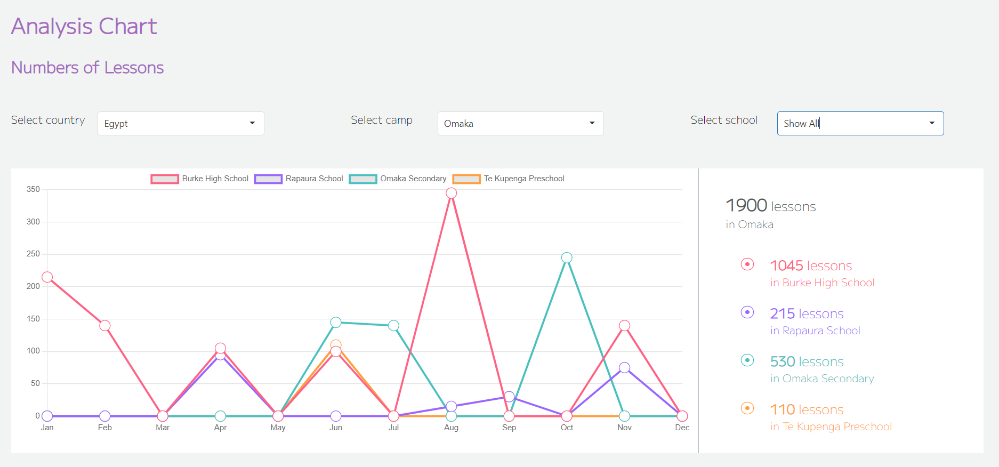

This repo is implementing the analytics dashboard that shown below in React:

Used Frameworks & Libraries:

1. React 
2. Typescript
3. react-chartjs-2
4. Jest
5. Enzyme
6. Eslint

In the project directory, you can run:

### `npm start`

Runs the app in the development mode.\
Open [http://localhost:3000](http://localhost:3000) to view it in the browser.

### `npm test`

Launches the test cases in the src/__test__ and src/__snapshots__.\

### `npx eslint src/*`
Running Eslint for the whole files inside ‘src’ directory.\
